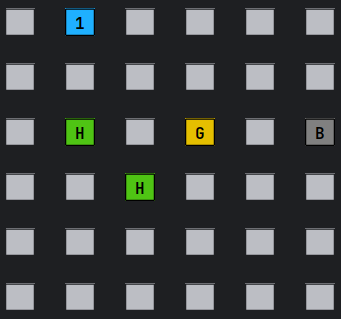
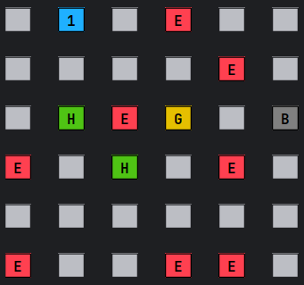

<pre>
  ________      .__    .___   ________                       
 /  _____/______|__| __| _/  /  _____/_____    _____   ____  
/   \  __\_  __ \  |/ __ |  /   \  ___\__  \  /     \_/ __ \ 
\    \_\  \  | \/  / /_/ |  \    \_\  \/ __ \|  Y Y  \  ___/ 
 \______  /__|  |__\____ |   \______  (____  /__|_|  /\___  >
        \/              \/          \/     \/      \/     \/ 
</pre>

# GridGame

A terminal-based tactical puzzle game featuring movement, danger, power-ups, and a hidden cheat mode.

GridGame is a small but complete Java console game designed around simple tactical decisions:
each player moves on their own board, tries to survive hidden enemies, collects power-ups, and races toward a goal.

---

## 📌 Features

### 🎮 Game Modes

* **Single Player (SP)**:
  Survive the board and reach the goal before your health drops to zero.

* **Multiplayer (MP)**:
  Each player has their own independent board.
  The match ends when:

    * A player reaches their goal, **or**
    * Only one player remains alive.

---

## ⚙️ Difficulty Settings

Each difficulty level changes:

* Board size
* Number of enemies
* Initial health
* (Internally) the minimum distance at which the goal is allowed to spawn

Difficulty presets:

| Difficulty     | Board Size | Enemies | Initial Health |
| -------------- | ---------- | ------- | -------------- |
| **1 – Easy**   | 6×6        | 8       | 4              |
| **2 – Normal** | 12×12      | 32      | 4              |
| **3 – Hard**   | 24×24      | 128     | 3              |

---

## 🧍 Player Setup

Each player selects:

* A **name** (1–8 characters, unique)
* A **marker** (automatically assigned: `'1'`, `'2'`, `'3'`, …)

Each player begins with:

* A certain amount of **health**
* A **bomb** (not guaranteed; must be found)
* A **health potion** (found on the board)
* A one-use **Count ability** (reveals remaining enemies)

---

## 🗺️ Board Layout

Each player has their own square grid containing:

| Marker                         | Meaning         |
|--------------------------------|-----------------|
| ` `                            | Empty tile      |
| `E`                            | Enemy           |
| `H`                            | Health pickup   |
| `B`                            | Bomb pickup     |
| `G`                            | Goal tile       |
| Player marker (`1`, `2`, etc.) | Player position |

**Note:** Enemies (`E`) are *normally invisible* during gameplay.  
They only appear visually on the board when Cheat Mode is enabled.

---

## 🧭 Movement System

A move is always written as **`<distance><direction>`**, e.g.:

```
2A
1D
3S
```

### Allowed distances:

* **1 to 3** (constant across all difficulties)

### Allowed directions:

* **A** → move left
* **D** → move right
* **W** → move up
* **S** → move down

### Toroidal movement

The board wraps around: going off one edge places you on the opposite side.

*(Imagine a Pac-Man grid.)*

---

## 💥 Interactions

When landing on a tile:

| Tile | Effect                          |
| ---- | ------------------------------- |
| `E`  | Take 1 damage, enemy disappears |
| `H`  | Heal +1, pickup disappears      |
| `B`  | Gain a bomb, pickup disappears  |
| `G`  | Immediate victory               |
| ` `  | Nothing happens                 |

After each move, **all remaining health pickups are redistributed randomly**.

---

## 💣 Bomb Ability

If the player has a bomb:

* They may choose the **Bomb** option in the menu.
* It destroys all enemies **within a 5×5 area centered on the player**.
* One-time use per pickup.

---

## 🧮 Count Ability (one-time)

The **Count** ability:

* Costs 1 health.
* Reveals how many enemies remain on the player's board.
* The result differs for:

    * 0 enemies
    * 1 enemy
    * More than 1 enemy

---

## 🕹️ Turn Menu

Players choose:

| Option         | Available When                    | Description                 |
| -------------- | --------------------------------- | --------------------------- |
| **0 – Count**  | If player still has Count ability | Reveals remaining enemies   |
| **1 – Move**   | Always                            | Perform movement            |
| **2 – Legend** | Always                            | Shows legend for tile icons |
| **3 – Bomb**   | If player has a bomb              | Uses the bomb               |

---

## 😎 Secret Cheat Mode

Typing:

```
cheat
```

In **any menu or movement prompt**:

* Toggles Cheat Mode ON/OFF.
* Cheat mode reveals enemy positions on the board.
* Does NOT consume the player's turn.

By default, enemies are hidden on the board.  

This acts as a development/debugging tool.

---

## 📸 Example Screenshots

### 🏁 Player board example



### 🔍 Cheat mode enabled



---

## 🏛️ Architecture Overview

Packages and core components:

```
com.alejandroacg.gridgame
│
├── Main.java            → Game loop, input flow, turn logic
├── Board.java           → Board generation, movement, bomb, printing
├── Player.java          → Player state, marker, life, abilities
├── Difficulty.java      → Difficulty presets
├── Game.java            → Global game state (mode, winner)
├── Messages.java        → Localization via ResourceBundle
├── Validation.java      → Input validation utilities
└── Mode.java / Language.java → Enums
```

---

## 🏁 How to Run

Compile and run:

```bash
javac com/alejandroacg/gridgame/*.java
java com.alejandroacg.gridgame.Main
```

Requires:

* Java **17+** (recommended)
* Terminal with Unicode + ANSI support for colored output

---

## 🔐 License
This software and its source code are the exclusive property of the author.

Unless you have explicit written permission from the author, you MAY NOT:

- Use the software or source code.
- Copy or reproduce it.
- Modify or create derivative works.
- Distribute or publish it.
- Sublicense or sell it.
- Include it in other projects.

All rights reserved © 2025.

---

## ✔️ Future Improvements (ideas)

* Add toroidal distance checking when spawning the goal (**currently TODO**)
* Add a replay log or seed system
* Add adjustable movement range per difficulty
* Add ASCII animations or improved visualization

---
